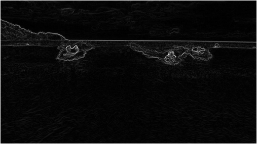
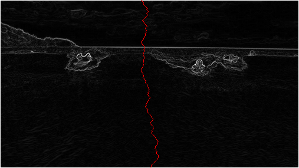
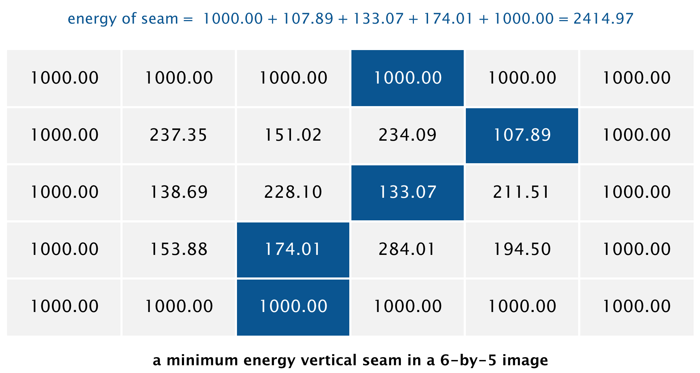
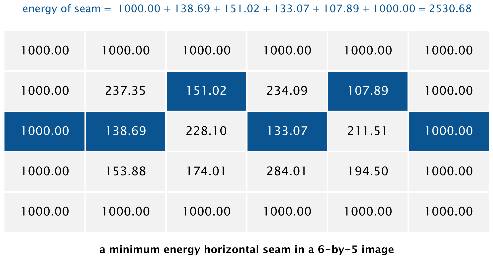

## Assignment Specification
http://coursera.cs.princeton.edu/algs4/assignments/seam.html

## Checklist 
http://coursera.cs.princeton.edu/algs4/checklists/seam.html

# Programming Assignment 2: Seam Carving

Seam-carving is a content-aware image resizing technique where the image is reduced in size by one pixel of height (or width) at a time. A *vertical seam* in an image is a path of pixels connected from the top to the bottom with one pixel in each row. (A *horizontal seam* is a path of pixels connected from the left to the right with one pixel in each column.) Below left is the original 505-by-287 pixel image; below right is the result after removing 150 vertical seams, resulting in a 30% narrower image. Unlike standard content-agnostic resizing techniques (e.g. cropping and scaling), the most interesting features (aspect ratio, set of objects present, etc.) of the image are preserved.

As you'll soon see, the underlying algorithm is quite simple and elegant. Despite this fact, this technique was not discovered until 2007 by Shai Avidan and Ariel Shamir. It is now a feature in Adobe Photoshop (thanks to a Princeton graduate student), as well as other popular computer graphics applications.

 

In this assignment, you will create a data type that resizes a W-by-H image using the seam-carving technique.

Finding and removing a seam involves three parts and a tiny bit of notation:

0. **Notation.** In image processing, pixel (x, y) refers to the pixel in column x and row y, with pixel (0, 0) at the upper left corner and pixel (W − 1, H − 1) at the bottom right corner. This is consistent with the [Picture](https://algs4.cs.princeton.edu/code/javadoc/edu/princeton/cs/algs4/Picture.html) data type in algs4.jar. **Warning:** this is the opposite of the standard mathematical notation used in linear algebra where (i, j) refers to row i and column j and with Cartesian coordinates where (0, 0) is at the lower left corner.
```
          a 3-by-4 image
  (0, 0)  	  (1, 0)  	  (2, 0)  
  (0, 1)  	  (1, 1)  	  (2, 1)  
  (0, 2)  	  (1, 2)  	  (2, 2)  
  (0, 3)  	  (1, 3)  	  (2, 3)  
```
We also assume that the color of a pixel is represented in RGB space, using three integers between 0 and 255. This is consistent with the [java.awt.Color](http://docs.oracle.com/javase/7/docs/api/java/awt/Color.html) data type.

1. **Energy calculation.** The first step is to calculate the *energy* of each pixel, which is a measure of the importance of each pixel—the higher the energy, the less likely that the pixel will be included as part of a seam (as we'll see in the next step). In this assignment, you will implement the *dual-gradient energy function*, which is described below. Here is the dual-gradient energy function of the surfing image above:



The energy is high (white) for pixels in the image where there is a rapid color gradient (such as the boundary between the sea and sky and the boundary between the surfing Josh Hug on the left and the ocean behind him). The seam-carving technique avoids removing such high-energy pixels.

2. **Seam identification.** The next step is to find a vertical seam of minimum total energy. This is similar to the classic shortest path problem in an edge-weighted digraph except for the following:
- The weights are on the vertices instead of the edges.

- We want to find the shortest path from any of the W pixels in the top row to any of the W pixels in the bottom row.

- The digraph is acyclic, where there is a downward edge from pixel (x, y) to pixels (x − 1, y + 1), (x, y + 1), and (x + 1, y + 1), assuming that the coordinates are in the prescribed range.



3. **Seam removal.** The final step is to remove from the image all of the pixels along the seam.

## The SeamCarver API. 
Your task is to implement the following mutable data type:

```java
public class SeamCarver {
   public SeamCarver(Picture picture)                // create a seam carver object based on the given picture
   public Picture picture()                          // current picture
   public     int width()                            // width of current picture
   public     int height()                           // height of current picture
   public  double energy(int x, int y)               // energy of pixel at column x and row y
   public   int[] findHorizontalSeam()               // sequence of indices for horizontal seam
   public   int[] findVerticalSeam()                 // sequence of indices for vertical seam
   public    void removeHorizontalSeam(int[] seam)   // remove horizontal seam from current picture
   public    void removeVerticalSeam(int[] seam)     // remove vertical seam from current picture
}
```

### Corner cases
Your code should throw a `java.lang.IllegalArgumentException` when a constructor or method is called with an invalid argument, as documented below:

- By convention, the indices x and y are integers between 0 and width − 1 and between 0 and height − 1 respectively, where width is the width of the current image and height is the height. Throw a `java.lang.IllegalArgumentException` if either x or y is outside its prescribed range.

- Throw a `java.lang.IllegalArgumentException` if the constructor, `removeVerticalSeam()`, or `removeHorizontalSeam()` is called with a null argument.

- Throw a `java.lang.IllegalArgumentException` if `removeVerticalSeam()` or `removeHorizontalSeam()` is called with an array of the wrong length or if the array is not a valid seam (i.e., either an entry is outside its prescribed range or two adjacent entries differ by more than 1).

- Throw a `java.lang.IllegalArgumentException` if `removeVerticalSeam()` is called when the width of the picture is less than or equal to 1 or if `removeHorizontalSeam()` is called when the height of the picture is less than or equal to 1.

### Constructor.
Because of the limitations of READMEs you should read this section on the [project specification page](http://coursera.cs.princeton.edu/algs4/assignments/seam.html)

### Finding a vertical seam.
The `findVerticalSeam()` method returns an array of length H such that entry y is the column number of the pixel to be removed from row y of the image. For example, the dual-gradient energies of a 6-by-5 image (supplied as [6x5.png](http://coursera.cs.princeton.edu/algs4/testing/seamCarving/6x5.png)).



The minimum energy vertical seam is highlighted in blue. In this case, the method findVerticalSeam() returns the array { 3, 4, 3, 2, 2 } because the pixels in a minimum energy vertical seam are (3, 0), (4, 1), (3, 2), (2, 3), and (2, 4). When there are multiple vertical seams with minimal total energy, your method can return any such seam.

### Finding a horizontal seam. 
The behavior of `findHorizontalSeam()` is analogous to that of `findVerticalSeam()` except that it returns an array of length width such that entry x is the row number of the pixel to be removed from column x of the image. For the 6-by-5 image, the method `findHorizontalSeam()` returns the array { 2, 2, 1, 2, 1, 2 } because the pixels in a minimum energy horizontal seam are (0, 2), (1, 2), (2, 1), (3, 2), (4, 1), and (5, 2).



### Performance requirements. 
The `width()`, `height()`, and `energy()` methods should take constant time in the worst case. All other methods should run in time at most proportional to width × height in the worst case. For faster performance, do not construct explicit `DirectedEdge` and `EdgeWeightedDigraph` objects.

### Analysis of running time (optional and not graded). 

- Give the worst-case running time to remove r rows and c columns from a width-by-height image as a function of r, c, width, and height.

- Estimate empirically the running time (in seconds) to remove r rows and c columns from a width-by-height image as a function of r, c, width, and H. Use tilde notation to simplify your answer.

*Deliverables.* Submit `SeamCarver.java`, and any other supporting files (excluding `algs4.jar` and `SCUtility.java`). You may not call any library functions other those in `java.lang`, `java.util`, `java.awt.Color`, and `algs4.jar`.

*This assignment was developed by Josh Hug, Maia Ginsburg, and Kevin Wayne.*
